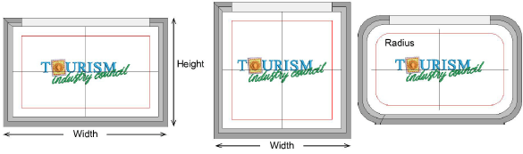
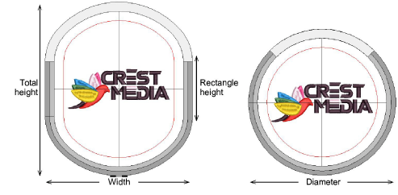
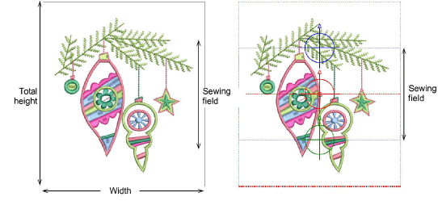

# Custom hoop types

You can create seven types of hoop:

- Oval
- 3 position
- Sliding
- Square
- Circle
- Round rectangle
- Rectangle

## Rectangular and square hoops

Set height and width according to the dimensions of the hoop you are using. With rounded rectangle hoops, set a corner radius in addition to height and width values.

## Oval and circular hoops

Set heights and width or diameter values according to the dimensions of the hoop you are using.

## Multi-position hoops

Three-position and sliding hoops allow large designs to be split manually and stitched without the usual registration problems. Sewing fields are in fixed positions with known dimensions, making it easy to register objects stitched in each position. In the software, they are displayed as colored rectangles – red, blue, or green. Define your own multi-position hoop according to the dimensions of the hoop you are using.

