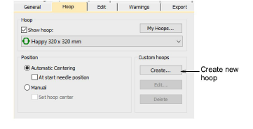
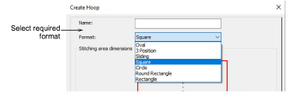
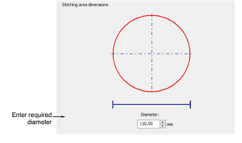
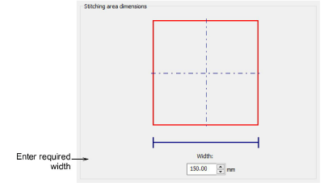
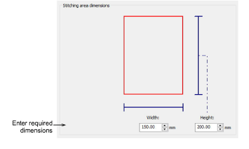
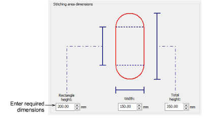
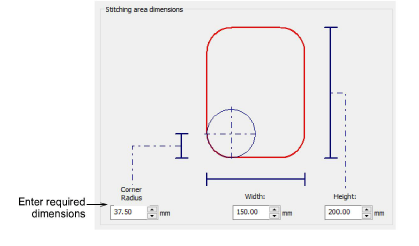
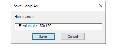
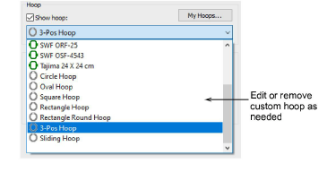
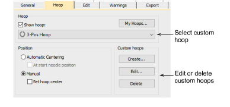

# Define custom hoops

|  | Click View > Show Hoop to turn hoop display on or off. Right-click to change hoop settings. |
| ---------------------------------------------- | ------------------------------------------------------------------------------------------- |

If you are using a hoop size that is not in the hoop list, you can define a custom hoop to conform to the dimensions of any physically existing hoops you may be using. Various formats are available to define anything from rectangular, oval, circle, to square hoops. You can edit and delete custom hoops at any time – both those you have defined yourself and those created by the system. Only custom hoops can be modified or removed, not those from the existing library.

## To define a custom hoop...

1Right-click the Show Hoop icon. The Options > Hoop dialog opens.

2Click Create. The Create Hoop dialog opens.

3Select the required format for your hoop from the droplist – e.g. rectangle, circle, etc.

4In the Stitching Area Dimensions panel, enter the dimensional characteristics of the stitching area:

- Circle: Circle stitching areas only require a Diameter to be specified.

- Square: Square stitching areas only require a Width to be specified.

- Rectangle: Rectangular stitching areas require Height and Width dimensions.

- Oval: Oval stitching areas require three dimensions – Total Height, Rectangle Height, and Width.

- Round Rectangle: Similar to oval stitching areas, round rectangles require three dimensions – Height, Width, and Corner Radius. The greater the radius, the rounder the corner.

5Click Save Hoop or Save Hoop As. The Save Hoop As dialog opens.

6Give your hoop a meaningful name – e.g. ‘Rectangle 180x120’.

7Click Save. Your user-defined hoop is now available for use along with the system-defined hoops.

## Tips for use...

- Once a new hoops are saved, they are available for use from the hoop droplist in the Options > Hoop tab.

- When selected, custom hoops can be edited or removed via the available buttons.

- If you open an EMB file which contains a custom hoop not included in the hoop list, or if the hoop has the same name as a listed one but different type and/or settings, EmbroideryStudio creates a new custom hoop with the same characteristics and tags it with a system-generated name.
