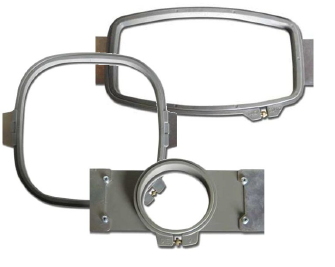

# Design Hooping

Devices made from wood, plastic, or steel, hoops are used to tightly grip fabric and stabilizer between an inner and outer ring. Designed to hold fabric taut against the machine bed for embroidering, they attach to the machine’s frame. Fabrics must be hooped before stitching out. EmbroideryStudio allows you to select from a wide range of standard factory-supplied hoops. You can also define your own from scratch or based on a standard hoop.

The Auto Hoop feature allows you to:

- Prompt EmbroideryStudio to select a hoop from a hoop library.
- Show/hide the selected hoop in the design window and design preview area of the production worksheet. [See also Print reports.](../reports/Print_reports)
- Create/edit/delete user-defined hoops with circle, oval, rectangle, round rectangle, or square shapes.
- Zoom-to-hoop in the design window and print preview.

## Related topics...

- [Hoops & templates](Hoops_templates)
- [Setting up hoop lists](Setting_up_hoop_lists)
- [Setting auto start & end](Setting_auto_start_end)
- [Selecting hoops automatically](Selecting_hoops_automatically)
- [Selecting hoops manually](Selecting_hoops_manually)
- [Creating custom hoops](Creating_custom_hoops)
