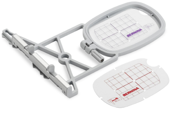
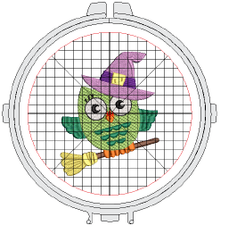

# Hoops & templates

When it comes to stitching out, it is important to align the fabric squarely in the hoop, with even pressure on all sides, and fabric patterns and weaves running perpendicular to the hoop. Otherwise, fabric bias allows stretch. This can distort stitching and result in puckering. Each hoop contains vertical and horizontal centering marks on the frames. These help with aligning both the fabric and the design.

Many hoops also come with a clear plastic template overlay. These include alignment lines, with tiny holes which allow you to create positioning marks. Hoop template display can be toggled on or off independently of the hoop itself.

Uses in the software...

- Templates include alignment and registration guide markings. These can help production staff align the design in the hoop.
- Templates can also be printed with alignment and registration markings. This allows you to cut out the printed design and align it in the hoop with the physical template.
