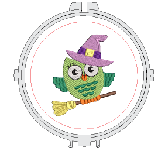
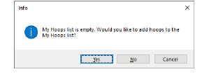
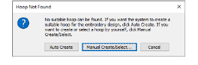
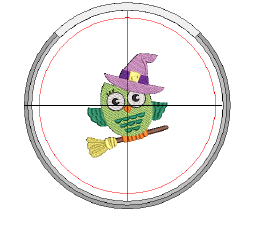
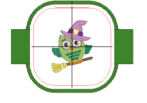
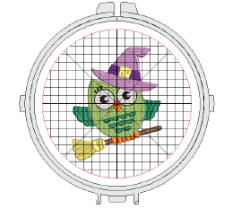

# Selecting hoops automatically

|  | Click View > Auto Hoop to prompt the system to select a suitable hoop automatically. |
| ------------------------------------ | ------------------------------------------------------------------------------------ |

The simplest way to hoop a design is to prompt the system to select a hoop for you. Auto Hoop finds the smallest hoop which can accommodate the entire design. Auto Hoop only selects hoops from the My Hoops list thus only ever suggesting a hoop you have pre-selected as available for use.

## To select a hoop automatically...

- Open your design and click the Auto Hoop icon or access the command from Design > Auto Hoop menu. From amongst its library of predefined hoops, EmbroideryStudio looks for a suitable hoop.

- If the My Hoops list is empty, the system prompts you to create a custom list.

- If the system cannot find a suitable hoop with a stitching area adapted to the current embroidery design, it displays a message with the option to create a new hoop, either automatically or manually.

- Click Auto Create if you want the system to generate a suitable hoop. EmbroideryStudio will create either a circular or rectangular hoop to best suit design dimensions. It will also name it accordingly – e.g. ‘Circle 100mm’.

- Click Manual Create/Select if you want to define your own hoop template to suit a specific hoop type you may have.

- Optionally, select View > Zoom > Zoom to Hoop or press Alt+0 to view the entire hoop in the design window.
- Optionally, turn on the Hoop Template display via the View menu. Templates can be used instead of grids. The template, especially when printed in the worksheet, provides a means for aligning the design in the hoop at the correct location and orientation.

::: tip
The current hoop name is displayed in the Prompt Line.
:::

## Related topics...

- [Setting up hoop lists](Setting_up_hoop_lists)
- [Define custom hoops](Define_custom_hoops)
