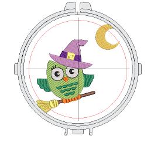
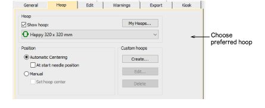
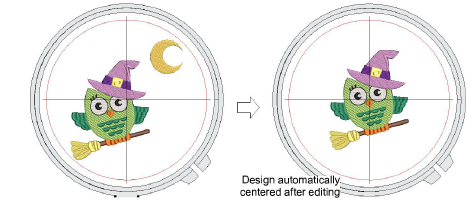
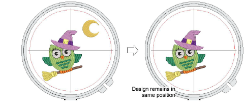
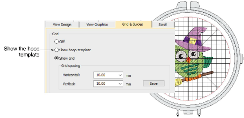

# Selecting hoops manually

|  | Click View > Show Hoop to turn hoop display on or off. Right-click to change hoop settings. |
| ---------------------------------------------- | ------------------------------------------------------------------------------------------- |
|        | Click Zoom > Zoom To Hoop to view entire hoop in the design window.                         |

From your My Hoops list, you can manually select your preferred hoop. Generally you will want to select the smallest hoop which will accommodate your design. This will hold the fabric tight while stitching. When you output your design, most machines will automatically center the design within the hoop according to its geometric extents. Some machines will center designs in the hoop at the start needle position. For these machines, you can set a starting point using Auto Start & End settings.

For display purposes, EmbroideryStudio will generally ensure that the design is centered in the hoop. However, you can use the manual option to lock the hoop position onscreen. This means it won’t automatically center while you are digitizing. It’s always a good idea, however, to turn auto-centering back on to check that the design will fit within the selected hoop.

## To change hoops...

- Open your design and click the Show Hoop icon. The current hoop is displayed. It may be too big or too small for your design.

- Right-click the icon. The Options > Hoop dialog opens.

- Select a hoop from the My Hoops list. Configure the list to include only those hoops you currently have available for use via the My Hoops function.
- In the Position panel, choose how you want the hoop to be positioned on the machine:
- Automatic centering: Ensure that design is always centered onscreen within the hoop.

Normally the hoop will center itself around the geometric center of the design. However, you have the option of centering around the start needle position. This option is usually used on conjunction with Auto Start & End settings.

- Manual: Use the manual option to make sure the hoop display does not move from its original position. This means it won’t automatically center while you’re digitizing. This may be important if you are combining embroidery with print or if you want to stitch out in certain locations like chest pockets.

- Manual > Set hoop center: Digitize a point on the design that the hoop will center around.
- Click OK. If you selected Set Hoop Center, click a point where you want to center the hoop.
- Use the View toolbar to turn on/off hoop.
- Optionally, click the Zoom to Hoop icon, select View > Zoom > Zoom to Hoop or press Alt+0 to view the entire hoop in the design window.
- Optionally, turn on the Hoop Template display via the Options dialog or View menu. The template may be used to help position your design within the hoop.

::: tip
You can include the hoop template in the production worksheet, together with alignment and registration guide markings. This allows you to cut out the printed design and align it within the hoop. Use the template markings to align it to physical hoop template.
:::

## Related topics...

- [Display grids, rulers & guides](../../Basics/basics/Display_grids_rulers_guides)
- [Scroll options](../../Setup/settings/Scroll_options)
