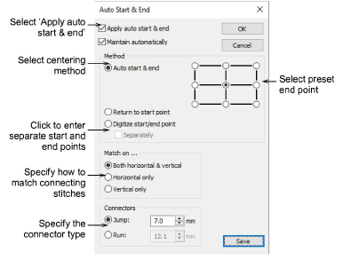
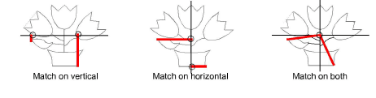

# Setting auto start & end

|  | Use View > Auto Start & End to toggle the Auto Start & End function on/off according to the current settings. Right-click to adjust settings. |
| -------------------------------------------------- | --------------------------------------------------------------------------------------------------------------------------------------------- |

Before stitchout, some embroidery machines require you to position the hoop precisely in relation to the needle. The Auto Start & End feature is available to connect first and last stitches in a design. This makes it easy to position the needle before stitching, and reduces the chance of the needle hitting the side of the frame.

::: info Note
Machines which auto-center designs around design extents will ignore the Auto Start & End setting.
:::

## To set automatic start & end points...

- Right-click Auto Start & End.

- Select the Apply checkbox to connect first and last stitches in the design.
- Select Maintain automatically to maintain the design center after modifying the design.
- Select a centering method:

| Method                   | Function                                                                                                                                                                                                                                                                            |
| ------------------------ | ----------------------------------------------------------------------------------------------------------------------------------------------------------------------------------------------------------------------------------------------------------------------------------- |
| Auto start and end       | By default, connecting stitches are created from the start and end points to the center of the design. Select one of the nine preset end points.                                                                                                                                    |
| Return to start point    | Creates a connecting stitch from the end point to the start point.                                                                                                                                                                                                                  |
| Digitize start/end point | Primarily used with multi-decoration designs where you want to strictly define the start/end point of the embroidery component. If you select this, you are prompted to select the point after clicking OK. Tick the ‘Separately’ checkbox to create separate start and end points. |

- Select to match connecting stitches on the Horizontal plane, Vertical plane or both in the Match On panel.

- Select the type and length of the connecting stitches in the Connectors panel.
- Click OK to confirm. Connectors – travel runs or jumps – are inserted as specified, before first and after last stitches of the design.

::: tip
Auto-start & end symbols – a green circle and a red cross – can be activated via the Options > View Design tab. [See Show auto-start & end points for details.](../../Setup/settings/Show_auto-start_end_points)
:::

::: warning Caution
Problems may occur when you try to set a common start and end point for team names.
:::

## Related topics...

- [Design viewing options](../../Setup/settings/Design_viewing_options)
- [Types of connectors](../../Quality/connectors/Types_of_connectors)
- [Outputting teamname designs](../../Lettering/lettering_names/Outputting_teamname_designs)
