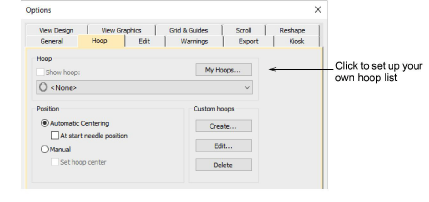
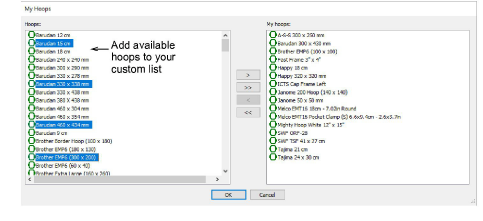

# Setting up hoop lists

|  | Click View > Show Hoop to turn hoop display on or off. Right-click to change hoop settings. |
| ------------------------------------ | ------------------------------------------------------------------------------------------- |

A range of commercial brands is available for a wide variety of design types. Configure the My Hoops list to include only those hoops you currently have available for use. If you are using a hoop that is not in the hoops list, you can define your own and save it for later use.

::: info Note
The Auto Hoop feature only selects hoops from the My Hoops list. Thus you need to set up this list before Auto Hoop is available for use.
:::

## To set up a hoop list...

- Right-click the Show Hoop icon. The first time you run it, the Options dialog will open with the My Hoops dialog already opened. Otherwise, click the My Hoops button.

- Use the My Hoops dialog to set up your own list of available hoops. Select from the listed hoops and use the arrow buttons to assign.

- Click OK to confirm. Only selected hoops will be available for manual or automatic selection.

::: tip
You may be working with hoops which don’t appear in the standard hoop list. Define your own hoops using circle, oval, rectangle, and other shapes.
:::

## Related topics...

- [Selecting hoops automatically](Selecting_hoops_automatically)
- [Creating custom hoops](Creating_custom_hoops)
