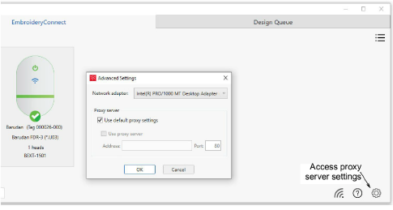

# Adjusting proxy & network adapter settings

Normally you will not need to touch proxy and network adapter settings. However, the Advanced Settings dialog exists to resolve any issues. For instance, proxy settings of the EmbroideryHub PC may not match those of the local network. Or, if the PC has multiple network adapter connections – e.g. both a wired Ethernet connection and a WiFi connection – conflicts may arise. To access settings, click the ‘cog’ button in the lower right corner of the main screen.

## Proxy settings

Default proxy settings are set in the Windows Internet Options dialog. Keep ticked for most situations. If you are using two networks with different proxy requirements, this may cause ‘504 errors’ to occur with the devices. You will need to untick default settings and use the other controls to specify the proxy configuration for your EmbroideryConnect network.

## Network adapter settings

The network adapter should be left on default most of the time. It’s only needed when there are multiple adapters connected to two different networks and there are device connectivity issues. If you have two adapters and find that the devices consistently switch from ‘Connected’ to ‘Disconnected’, select the adapter connected to the EmbroideryConnect network. EmbroideryHub should also be restarted.
