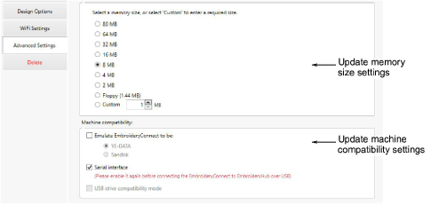

# Advanced device settings

Access the Advanced Settings tab to update USB memory size settings and machine compatibility settings as needed…

## Related topics...

- [Configuring EC device memory size](Configuring_EC_device_memory_size)
- [Disabling serial interface](Tweaking_machine_compatibility)
- [Emulating other devices](Tweaking_machine_compatibility)
- [Configuring sub-folders for Barudan machines](Configuring_sub-folders_for_Barudan_machines)
