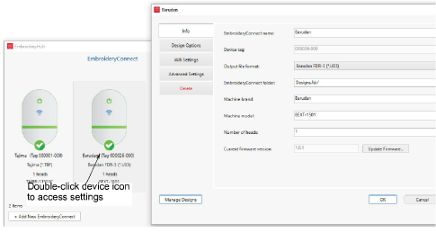
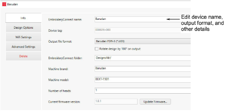
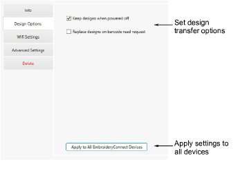
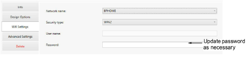
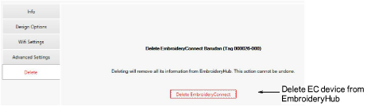

# Basic device settings

Once your devices are set up and connected to the target machines, you can further configure or modify them at any time. There is no need to re-attach the EC device to the EmbroideryHub PC. Settings can be modified across the network. Double-click the device icon in the main window to access settings.

## Device details

Access the Info tab to modify details provided during the setup procedure. Here you can change device name, output file type, and other details...

Note: Use ‘Rotate design by 180° on output’ to auto-rotate the design by 180° when output to machine file on a connected EC device. If the machine is dedicated for cap designs, tick this option.

## Design options

Access the Design Options tab to manage design options. All design transfers are securely encrypted across the EmbroideryConnect network. Various options are available for handling design transfers…

Design options can be modified as preferred for this EC device…

| Option                                  | Function                                                                                                                                                                                                                                            |
| --------------------------------------- | --------------------------------------------------------------------------------------------------------------------------------------------------------------------------------------------------------------------------------------------------- |
| Keep designs when powered off           | By default, designs stay on the device unless you remove them in the Manage Designs window. When unticked, designs are cleared from the device so they can’t be copied.                                                                             |
| Replace designs on barcode read request | When ticked, whenever the operator does a barcode scan to fetch a design, EmbroideryConnect will delete all existing designs on the device before transferring the scanned design. Some users only want one design on the device at any given time. |
| Apply to all                            | Click to apply the same settings to all EmbroideryConnect devices configured on the EmbroideryHub.                                                                                                                                                  |

## WiFi settings

The main reason for accessing the WiFi Settings tab is to update the network password…

## Delete EC device

Access the Delete tab to remove a selected EC device from EmbroideryHub.

