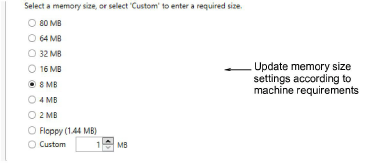
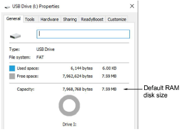

# Configuring EC device memory size

The default capacity of the EC device is 8MB. Most machines accept this size of USB memory stick. Some older machines require smaller sizes such as 4MB or Floppy disk size (1.44 Mb). It can take up to 30 seconds for changes to be made.

Caution: If you choose floppy memory mode (1.44 Mb), it may not work on newer machines.

You can confirm the change in memory size when the EC device is connected to the PC.

