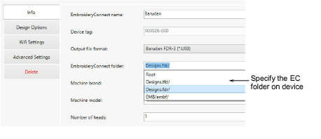

# Configuring sub-folders for Barudan machines

Sometimes you may need to specify a folder on the device which is different to the ‘root’. Different machines have different requirements. For example, ‘MyDesign.fdr/’. These are the same as requirements for sending a design via a USB stick. Make sure you include a ‘slash’ (/) at the end.

If the EC device will be used with a Barudan machine, a special sub-folder must be configured. Barudan machines will not read designs from the root folder of any USB stick. You can edit the folder structure on the EC device whenever necessary.
