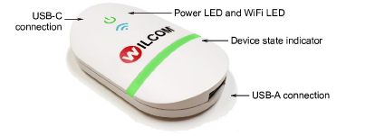

# EmbroideryConnect device

A separate EmbroideryConnect device is needed for each embroidery machine on the network. Designs can be ‘pushed’ to a named device or ‘pulled’ via barcode reader at each machine.

## Device features

Device features are summarized below:

| Item                     | Description                                                                                                                 |
| ------------------------ | --------------------------------------------------------------------------------------------------------------------------- |
| EmbroideryConnect device | The device itself is small and compact. It can plug directly into an embroidery machine USB port or via USB extender cable. |
| USB-C connection         | USB-C connection at top to connect device to PC or embroidery machine.                                                      |
| USB-A connection         | Separate USB-A input port for USB barcode reader.                                                                           |
| Device state indicator   | The device displays basic status information. See below for details.                                                        |
| Power from USB           | No separate power supply needed – power is drawn from USB port.                                                             |

Tip: The EC device comes with 3M mounting strips to attach it to the target machine.

## EC device states

The EC device indicates various devices states. The following table explains the color coding…

| When…                       | Status light    | Status                                                       |
| --------------------------- | --------------- | ------------------------------------------------------------ | --- |
| Attaching device to machine | Solid green     | Device is running smoothly so machines can access designs.   |
| Scanning barcode            | Flashing orange | Barcode scan failed. Scanned file not found in design queue. |
|                             | Flashing purple | Device cannot connect to EmbroideryHub for design request.   |     |
| Sending design to device    | Flashing yellow | Device is unmounted.                                         |
|                             | Flashing orange | Sent file already exists on device.                          |     |
|                             | Flashing red    | Error occurred.                                              |     |
