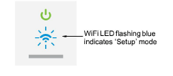

# EmbroideryConnect setup

|  | Double-click to start EmbroideryHub. |
| ------------------------------------------------------ | ------------------------------------ |

Setting up an EmbroideryConnect network is easy…

- A single device is required for each embroidery machine.
- A dedicated network PC acts as the ‘hub’ and runs the EmbroideryHub software.
- All devices are configured to the EmbroideryHub PC.
- All secondary PCs access the EmbroideryConnect network via the EmbroideryHub.

## To configure an EmbroideryConnect device...

1. Ensure the ‘hub’ PC has an active internet connection.

2. Start EmbroideryHub from the program group or desktop.

When first run, the device list in the EmbroideryHub main window is empty.

3. Plug the EC device into the computer via the USB-C port located at the top.

4. Ensure all lights are in ‘Setup’ mode. When the power LED is solid green and the WiFi LED is flashing blue, the device has finished booting. This generally takes about 60 seconds.

5. Click Add New EmbroideryConnect and follow the setup wizard prompts.

- If an unconfigured EC device is detected, the process will open the wizard directly and take you to the next step.
- If no EC device is detected, the dialog below will appear. Check the device is correctly attached and has finished booting. Click Next when the button becomes available.

- If more than two unconfigured EC device are connected, the dialog below will appear. The code displayed corresponds to the tag number on back of the device. Select a device and click Setup.

6. When prompted, select your WiFi network and click Next.

7. Enter the WiFi password and click Next.

8. Identify the EmbroideryConnect device and specify output options.

Options include:

| Option                   | Function                                                                                                                                                  |
| ------------------------ | --------------------------------------------------------------------------------------------------------------------------------------------------------- |
| EmbroideryConnect name   | Give the device a unique name associated with the connected machine – e.g. ‘Tajima #2’.                                                                   |
| Output file type         | Specify the machine file type for the selected machine – e.g. \*.TBF. Design files will be converted on-the-fly to this format.                           |
| EmbroideryConnect folder | Specify the folder on the device if different to the ‘root’ folder. Machine requirements are the same as those for sending a design via normal USB stick. |
| Machine brand            | This field is simply descriptive to help identify the machine associated with the EC device.                                                              |
| Number of heads          | This is a descriptive field.                                                                                                                              |
| Machine model            | This is a descriptive field.                                                                                                                              |

9. Click Finish.

10. Wait for the EC device to connect to the network and EmbroideryHub. The blue WiFi LED will flash and then turn solid blue when it has successfully connected.

Connection takes about 60 seconds depending on network traffic.

11. Once configured, remove the EC device from the EmbroideryHub PC and connect it to the target machine.

::: tip
The EC device comes with 3M mounting strips to attach it to the machine.
:::

12. Again, ensure all lights return to ‘Ready’ mode. You can now send designs to this device from EmbroideryStudio.

13. Configure your other devices in the same way.

::: info Note
The EmbroideryHub needs to remain active at all times in order to manage the design flow to all connected EmbroideryConnect devices.
:::
