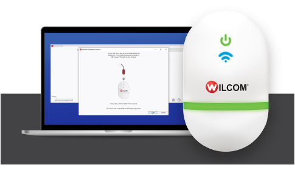

# Machine Networking

The EmbroideryConnect capability allows you to wirelessly transfer embroidery designs from EmbroideryStudio to USB-enabled embroidery machines. Machine files are automatically generated and sent via a standard WiFi network to an EmbroideryConnect device plugged into a compatible machine. Design transfers are securely encrypted.

Most modern embroidery machines like Tajima, Barudan, Happy, ZSK, Ricoma and SWF, can read files from a standard USB memory stick. With EmbroideryConnect, there is no need for serial ports, different interface methods, or machine cabling.

The EC device is of great potential benefit to commercial embroiderers who want to network any brand of commercial or ‘prosumer’ embroidery machines and need a choice of ‘push’ or ‘pull’ wireless transfer methods. Benefits can also be found for retail kiosk operators.

This section presents an overview of the product concepts, installation, configuration, and basic usage for EmbroideryConnect.

## Related topics...

- [Network overview](Network_overview)
- [EmbroideryConnect setup](EmbroideryConnect_setup)
- [Basic device settings](Basic_device_settings)
- [Advanced device settings](Advanced_device_settings)
- [Sending designs to EmbroideryConnect](Sending_designs_to_EmbroideryConnect)
- [If you have created a folder structure, double-click the ‘..’ at the top of the list to move up a folder level.](View_manage_designs_on_EmbroideryHub)
