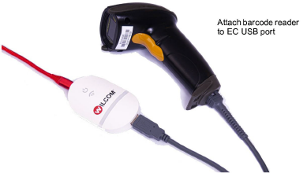
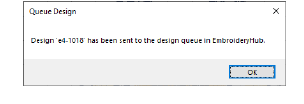
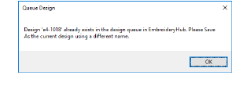
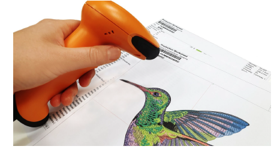

# Push designs to EmbroideryConnect design queue

|  | Use Standard > Queue Design to send the current design to the EmbroideryConnect design queue where they can be ‘pulled’ from the machine. |
| ------------------------------------------ | ----------------------------------------------------------------------------------------------------------------------------------------- |

Open EmbroideryStudio and load the design or designs you want to send to EmbroideryHub. When you ‘push’ a design to a queue, you don’t know (or care) which machine it gets stitched on. Different production environments have different methods. The bigger and busier the concern, the more likely you are to use the ‘push’ method.

## To push a design to the EmbroideryConnect design queue...

- Click a design tab and click the Queue Design icon. A confirmation message will appear indicating that the design is in the queue.

- An error check prevents you from sending multiples of the same design to the queue.

- Repeat for all designs you want to queue up in preparation for production.
- On the machine itself, the operator can ‘pull’ designs to the EC device by means of a barcode reader attached to the USB port. Scan the barcode printed on the production worksheet. The design will be pulled from the queue to the EC device. Here it can be loaded into machine memory for production.

