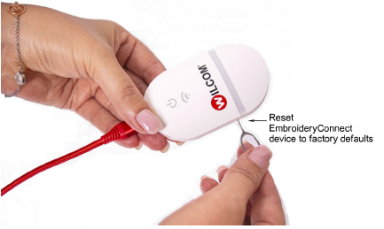

# Reset the device

If you turn off the serial interface and subsequently lose WiFi connection to the EC device, the only way to reconfigure it is to perform a ‘hard reset’. Power up the device and insert a hairpin into the Reset aperture on the side. Hold it for 10 seconds. This restores the device to whatever firmware it was initially programmed with. The EC device must then be reconfigured using EmbroideryHub.

Tip: If this doesn’t solve the problem, go to the [Help & Support](http://help.wilcom.com) site and check for updates.
