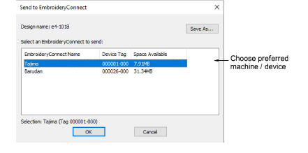
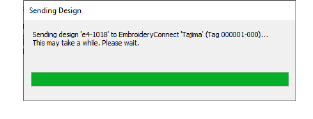

# Send designs to EmbroideryConnect device

|  | Use Standard > Send to EmbroideryConnect to send the current design to a named EmbroideryConnect device. |
| ------------------------------------------------------------------ | -------------------------------------------------------------------------------------------------------- |

Open EmbroideryStudio and load the design or designs you want to send to EmbroideryConnect.

## To send a design to an EmbroideryConnect device...

- Select a design tab and click the Send to EmbroideryConnect icon. The dialog will show a list of named devices connected to the network.

- Choose your preferred device and click OK. The design will be automatically converted to the corresponding machine file format and sent to the EC device. Here it can be loaded into machine memory for stitching.

- Repeat for all designs you want to send to named devices connected to the network.
