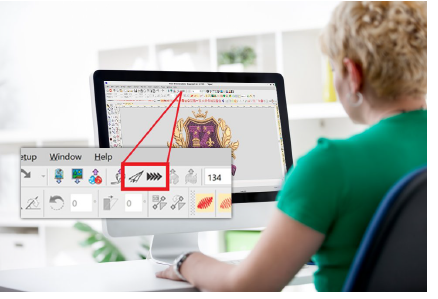

# Sending designs to EmbroideryConnect

Once you have configured one or more devices on your EmbroideryConnect network, you have the choice of sending designs to a named device or ‘pushing’ them to a queue where they can be ‘pulled’ from the machine itself. You can use any PC running EmbroideryStudio on your local WiFi network to send designs.

## Related topics...

- [Send designs to EmbroideryConnect device](Send_designs_to_EmbroideryConnect_device)
- [Push designs to EmbroideryConnect design queue](Push_designs_to_EmbroideryConnect_design_queue)
- [View & manage designs on EmbroideryHub](View_manage_designs_on_EmbroideryHub)
