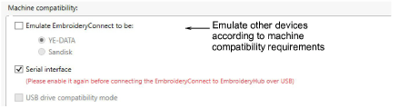
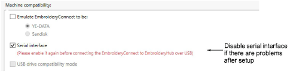
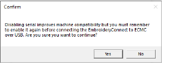

# Tweaking machine compatibility

A number of machine compatibility options are available under Advanced Settings. It may be necessary to enable one or other of these to ensure compatibility between your machine controller and the EC device. If for any reason you lose WiFi connection to the EC device, the only way to reconfigure it is to perform a ‘hard reset’. [See If you have created a folder structure, double-click the ‘..’ at the top of the list to move up a folder level. for details.](View_manage_designs_on_EmbroideryHub)

## Emulating other devices

EmbroideryConnect can emulate other types of device. Some machines can only read designs from YE-DATA or Sandisk. For example, Tajima TEJT-II-C embroidery machines require these types of device. EmbroideryConnect can be set to emulate them.

## Disabling serial interface

By default, EmbroideryConnect devices have the USB serial interface enabled in order to configure them on EmbroideryHub. It is best to leave the setting activated in case you need to reconfigure the device. However, if the embroidery machine has a problem with WiFi and serial interface, you may need to disable it. With the EC device connected, the machine may lock up and display an unexpected message.

Untick the Serial interface function and click OK. You will receive the following warning…

Note: If you turn off the serial interface and subsequently lose WiFi connection to the EC device, the only way to reconfigure it is to perform a ‘hard reset’. [See If you have created a folder structure, double-click the ‘..’ at the top of the list to move up a folder level. for details.](View_manage_designs_on_EmbroideryHub)

## USB drive compatibility mode

There’s an option to run the EC device in ‘USB drive compatibility mode’. This may improve machine compatibility in some cases. For instance, if you are using Tajima X16 controllers or machines like Janome MB-4 and Janome MC12000:

- Tick both ‘USB drive compatibility’ and ‘disable serial interface’. In other words, USB drive compatibility should be enabled and serial interface disabled.
- Only do this after the device has been set up and is working.
- If you reset the device for any reason, make sure ‘disable serial interface’ is unticked.

Note: The option is grayed out if the device does not have firmware version 1.0.1 or greater.
