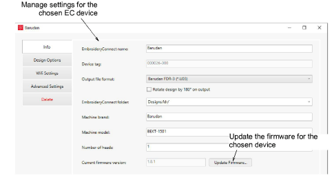

# Update the firmware

The [Help & Support](http://help.wilcom.com) site will periodically publish firmware updates for the EC device. These may fix known compatibility problems for certain machines or support new features and fixes to the device. Any updates should not compromise your existing setup.

## To update the firmware...

1. Open EmbroideryHub, access the device settings, and ensure ‘Serial interface’ is activated.

2. Download and install the latest version of EmbroideryStudio from the Wilcom [Help & Support](http://help.wilcom.com) site, if not already installed.

3. Save a copy of the firmware update file to the EmbroideryHub PC. This will have been sent to you or downloaded from the [Help & Support](http://help.wilcom.com) site. Firmware files have a ‘.WIL’ extension which is an encrypted format.

4. Plug the EC device into the computer via the USB-C port located at the top.

::: info Note
Devices configured to ‘1.0.0’ must be re-attached to the EmbroideryHub PC for the update to work properly. For all other updates, there is no need. Settings can be modified across the network.
:::

5. Double-click the device icon in the EmbroideryHub main window to access device settings.

6. On the Info tab, click the Update button to access the Update Firmware dialog.

7. Click the Browse button and locate the firmware update file in the save location.

8. Click Update to proceed. A confirmation message warns you that all design files will be cleared from the device.

9. Click Yes to proceed. Progress messages will tell you the current status of the firmware update.

10. Once you have confirmation that the EC device is updating, you can close the device settings dialog and move to the next device. No need to wait until the current one has finished updating. Each device must be individually updated.
