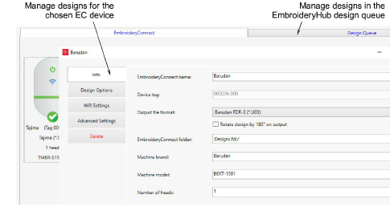
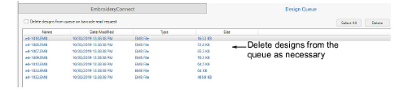
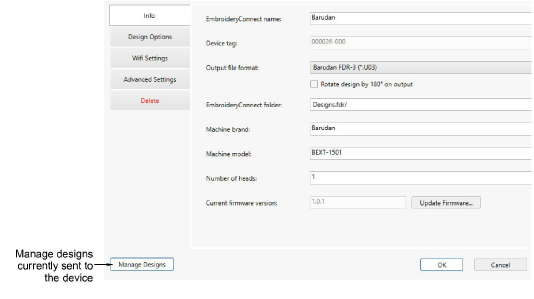
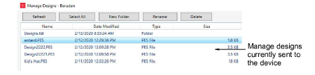

# View & manage designs on EmbroideryHub

From EmbroideryHub, you can view and manage designs sent both to particular machines as well as to the design queue.

## To view and manage designs on EmbroideryHub...

- Open EmbroideryHub on the EmbroideryHub PC.

- Click the Design Queue tab to view queued designs in EmbroideryHub. Here you can delete designs as necessary.

- If you want to view designs sent to the chosen EC device, click the Manage Designs button on the device settings dialog.

- A list of designs pending production on the target machine is displayed. Here you create new folders, and rename or delete designs as preferred.

::: tip
If you have created a folder structure, double-click the ‘..’ at the top of the list to move up a folder level.
:::
