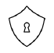

# What is an EmbroideryConnect network?

The concept behind the EmbroideryConnect network is described by the following diagram…

Note: Anyone on the same EmbroideryConnect network who has EmbroideryStudio running can send a design to an EC device or design queue on an EmbroideryHub. However, there can only be one EmbroideryHub running on the same network.

## End-user benefits

What are the benefits of the EmbroideryConnect capability?

|  | Simple and easy to use... Easy to install and configure. Connect to existing WiFi and eliminate complicated network setup and configuration. Plug into any USB-enabled embroidery machine. Wireless design transfer – no need for network cables. Mix and match different brands of machine on the same network. |
| ------------------------------------------ | ---------------------------------------------------------------------------------------------------------------------------------------------------------------------------------------------------------------------------------------------------------------------------------------------------------------- |
|    | The right design, every time... Machine file automatically generated on output. Convenient operation with the pull method. No risk of selecting wrong design for the order.                                                                                                                                      |
|  | Safe and secure... Correct design loaded to the correct embroidery machine. Designs encrypted during transfer and, optionally, removed automatically from the design queue. Optionally, designs deleted from the EC device when disconnected.                                                                    |
