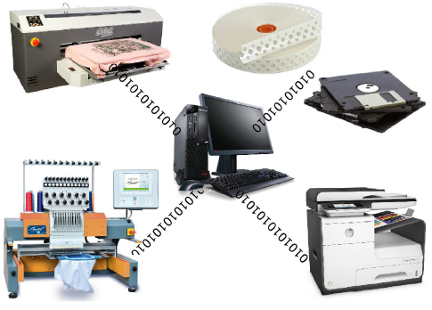

# Embroidery Output

Once an embroidery design is complete, you can output for actual stitchout in a variety of ways – sending directly to machine for stitching, or saving to specific machine formats and/or to [embroidery disk](../../glossary/glossary).

Tip: From the same design file, you can also output a [production worksheet](../../glossary/glossary) for the embroidery machine operator. [See Design Reports for details.](../reports/Design_Reports)

## Related topics...

- [Sending designs to machine](Sending_designs_to_machine)
- [Exporting designs for machine](Exporting_designs_for_machine)
- [Using embroidery disks](Using_embroidery_disks)
