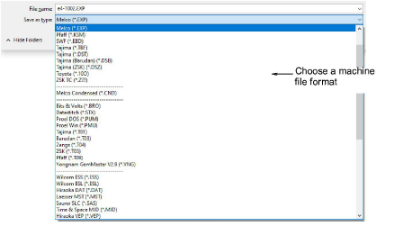

# Export designs to machine file

|  | Use Standard > Export Machine File to export the current design to a machine file for stitching. |
| ------------------------------------------------------ | ------------------------------------------------------------------------------------------------ |

Converting an open design to machine file format is as simple as choosing File > Export Machine File. EmbroideryStudio reads and converts all popular formats. Designs originally created in EmbroideryStudio generally give the best results. Other file types may not have all the data necessary for successful conversion.

For older machines, you can also save designs to proprietary [embroidery disk](../../glossary/glossary). [See Using embroidery disks for details.](Using_embroidery_disks)

Caution: If a design feature is not available in the file type you select, it will be converted – e.g. Flexi Split stitching may be changed to plain Tatami.

## Related topics...

- [Converting designs](../../Management/manage_designs/Converting_designs)
- [Send designs to Connection Manager](Send_designs_to_Connection_Manager)
- [Using embroidery disks](Using_embroidery_disks)
- [Machine Formats](../../Setup/machines/Machine_Formats)
