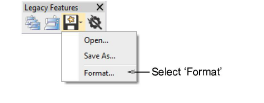
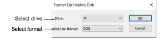
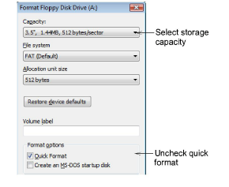

# Format embroidery disks

|  | Use Legacy Features > Embroidery Disk to format proprietary embroidery disks. |
| ---------------------------------------------------------- | ----------------------------------------------------------------------------- |

Embroidery disks must be formatted to suit the embroidery machine you intend to use or it will not be able to read the design. Older computers generally have a High Density 1.44 Mb drive. Most embroidery machines use High Density disks so there is usually no problem with transferring designs. See your machine manual for details.

## To format embroidery disks...

1. Insert a 3.5" floppy disk of the correct density in your computer’s floppy disk drive.

::: info Note
Use the disk type required by the embroidery machine, not the computer.
:::

2. Select Embroidery Disk > Format.

The Format Embroidery Disk dialog opens.

3. From the Drive list, select the floppy disk drive.

4. From the Diskette Format list, select the required disk format.

5. Click OK to confirm. The Format dialog opens. This is a MS Windows® system dialog and may vary with the particular operating system you are using.

6. From the Capacity list, select the disk storage capacity.

7. In the Format Options panel, select the ‘full format’ option. Quick Format erases all data from the disk but does not reformat it. Uncheck the option to reformat a blank disk. See your MS Windows® manual for details.

8. Click Start. A progress bar appears. You are prompted when formatting is complete.

::: info Note
If you have trouble with formatting a Melco [embroidery disk](../../glossary/glossary#embroidery-disk), check if your floppy disk drive can read and write single density floppy disks.
:::
