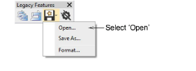
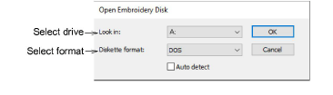
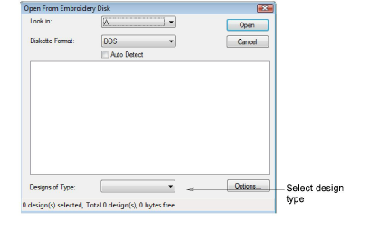

# Read designs from embroidery disk

|  | Use Legacy Features > Embroidery Disk to open designs from or save to proprietary embroidery disk formats. |
| ------------------------------------------------ | ---------------------------------------------------------------------------------------------------------- |

You can open designs of other formats from specially formatted 1.44 Mb DS/HD (Double-Sided High-Density) [embroidery disks](../../glossary/glossary).

## To read designs from embroidery disk...

1Insert the embroidery disk in your computer’s floppy disk drive.

2Select Embroidery Disk > Open.

The Open Embroidery Disk dialog opens.

3From the Look In list, select the floppy disk drive.

4Select the disk format. Either:

- Select the format from the Diskette Format list.
- Select the Auto Detect checkbox and let EmbroideryStudio automatically determine the format. This generally takes longer.

5Click OK. The Open From Embroidery Disk dialog opens.

6From the Designs of Type list, select a design type. Any designs saved on disk are listed in the panel. If no designs are listed, make sure that the correct drive and disk format are selected.

Note: If the Options button is available, you can set [recognition](../../glossary/glossary) options for the design.

7Click Open.

## Related topics...

- [Embroidery file formats](../../Management/formats/Embroidery_file_formats)
- [Melco CND format](../../Management/formats/Melco_CND_format)
- [Gunold PCH format](../../Management/formats/Gunold_PCH_format)
- [Open machine files](../convert/Open_machine_files)
