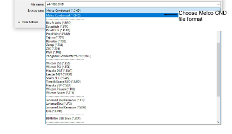
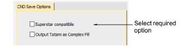

# Save designs in Melco CND format

You can save files to Melco CND format from EmbroideryStudio. Some stitch quality features, stitch types, and decorative fills and effects do not convert well. If you intend to save a file in CND format, you should only use input methods, stitch types and effects that are compatible with Melco EDS-III software.

## Trim functions

Superstar-compatible machines do not have trimmers. If you want to stitch a design to a machine without trimmers, set machine values to not output Trim codes. Then digitize the design for manual trimming. Early versions of CND do not support Melco Trim codes. In this case, set the [machine format](../../glossary/glossary) values to output Trims as Jumps.

## Turning Tatami fills

When you save to CND format, you need to specify how to convert turning tatami stitches. Objects with curving tatami stitches – e.g. Column A objects – are not supported by early versions of CND format. For Superstar-compatible machines, turning tatami stitches are simply converted to Walk stitches, the EDS equivalent of Manual. For earlier machines, turning tatami fills need to be converted to normal tatami – i.e. with a single [stitch angle](../../glossary/glossary) – then to Normal Fill, the EDS equivalent of normal tatami.

## To save designs in Melco CND format...

1. Select File > Export Machine File. The Export Design dialog opens.

2. Choose Melco CND from the Files of Type list.

3. In the File name field, enter a name for the design.

4. Click Options. The Save Options dialog opens.

5. Select the required option for converting Turning Tatami fills:

| Option                        | Function                                                                                                                                                                                 |
| ----------------------------- | ---------------------------------------------------------------------------------------------------------------------------------------------------------------------------------------- |
| Superstar Compatible          | Converts turning tatami to Walk (EDS equivalent of Manual). Complex Fill tatami is output as Normal Fill (EDS equivalent of tatami). Superstar-compatible machines do not have trimmers. |
| Output Tatami as Complex Fill | Converts turning tatami fills to normal tatami – i.e. with a single stitch angle – then to EDS Normal Fill.                                                                              |

Note: These functions are also available when you send a CND design for stitching.

6. Click OK and then Save.

## Related topics...

- [Standard machine formats](../../Setup/machines/Standard_machine_formats)
- [Melco CND format](../../Management/formats/Melco_CND_format)
- [Conversion of Melco CND format to Wilcom EMB](../../Management/formats/Conversion_of_Melco_CND_format_to_Wilcom_EMB).
