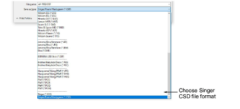
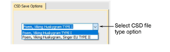

# Save designs in Singer CSD format

The CSD Save Options allows you to select between CSD Type I and Type II.

## To save designs in Singer CSD format...

1Select File > Export Machine File. The Export Design dialog opens.

2Select CSD from the Files of Type list.

3In the File name field, enter a name for the design.

4Click Options. The Save Options dialog opens.

5Select the required CSD file type option.

- Type II was introduced in CS 1.2B software for the POEM machine.
- Type II is also used by the Singer EU software for the POEM machine.
- Type II files also store thread color RGB values and an icon of the design.

6Click OK and then Save.

## Related topics...

- [Opening machine files](../convert/Opening_machine_files)
