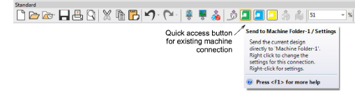
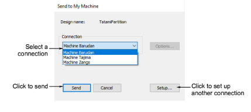

# Send designs to Connection Manager

|  | Use Standard > Send to Connection Manager to connect to supported machines via proprietary machine software. |
| ------------------------------------------------------------------ | ------------------------------------------------------------------------------------------------------------ |

Newer machines use USB or Wired-Wireless network connections. They can appear as a disk drive or be setup to read designs from a folder on the PC. Some machines such as Janome MB-4 and Barudan LEM are supplied with propriety connection software. EmbroideryStudio supports connection to these machines via Connection Manager. Each machine connection:

- Has a unique name and ‘quick-access’ button
- May have a unique folder to which designs can be sent. From here they can be accessed from the machine control panel or third-party connection software.

## To send a design to Connection Manager...

- Ensure that the target machine is correctly connected to your PC. See your machine documentation for details.
- If a connection already exists, click the quick-access button to send the design to a predefined location.

- Alternatively, click the Send to Connection Manager icon.
- If no connections currently exist, you will be prompted to set one up. [See Setting up machines for Connection Manager for details.](../../Setup/hardware/Setting_up_machines_for_Connection_Manager)
- If a connection already exists, the dialog opens.

- Select a connection from the droplist and click Send.
- Using the machine controller or third-party connection software, access the design from the network or PC folder.
- Load or send the design and stitch it on the machine.

## Related topics...

- [Setting up machines for Connection Manager](../../Setup/hardware/Setting_up_machines_for_Connection_Manager)
