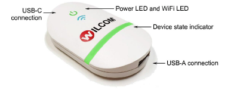

# Send designs to EmbroideryConnect

|  | Use Standard > Send to EmbroideryConnect to send the current design to a named EmbroideryConnect device.                                  |
| ------------------------------------------------------------------ | ----------------------------------------------------------------------------------------------------------------------------------------- |
|                          | Use Standard > Queue Design to send the current design to the EmbroideryConnect design queue where they can be ‘pulled’ from the machine. |

Once you have set up one or more EmbroideryConnect devices on your network, you have the choice of ‘pushing’ designs or ‘pulling’ them from the EmbroideryHub. The Send to EmbroideryConnect button allows you to send a design to a named EC device. Alternatively, use the Queue Design to ‘push’ designs to a queue where they can be ‘pulled’ from the machine itself.

## Related topics...

- [Sending designs to EmbroideryConnect](../network/Sending_designs_to_EmbroideryConnect)
- [Machine Networking](../network/Machine_Networking)
