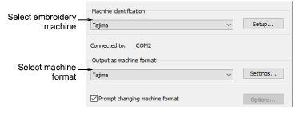
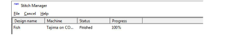

# Send designs to Stitch Manager

|  | Use Legacy Features > Send to Stitch Manager to send a design to any supported embroidery machine without changing the original design format. |
| ---------------------------------------------------------- | ---------------------------------------------------------------------------------------------------------------------------------------------- |

Once a design is complete, you can stitch it out to any supported embroidery machine without changing design format. If a selected machine does not support a particular function included in the design, it is simply ignored. When you send several designs in a row, they are automatically queued and stitched out one at a time.

## To send a design to Stitch Manager...

1. Ensure that the target machine is correctly connected to your PC. See your machine documentation for details.

::: info Note
Before you can send designs for stitching, you must also configure the machine in EmbroideryStudio.
:::

2. Open a design.

3. Click the Send to Stitch Manager icon. The dialog opens.

4. From the Machine Identification list, select an embroidery machine. Click Setup to modify machine settings as required.

5. From the Output as Machine format list, select the correct [machine format](../../glossary/glossary#machine-format). Click Values to modify the machine format settings as required.

::: info Note
This field is automatically updated if the target machine format is different to the current format. Select the Prompt Changing Machine Format checkbox if you want to be prompted when the Output as Machine Format field updates.
:::

6. Click OK to return to the Send to Stitch Manager dialog.

7. Click OK. The Stitch Manager dialog opens listing the files to be stitched out.

::: tip
To delete a design from the queue, select it and click Cancel.
:::

## Related topics...

- [Hardware Settings](../../Setup/hardware/Hardware_Settings)
- [Setting up machines for Stitch Manager](../../Setup/hardware/Setting_up_machines_for_Stitch_Manager)
- [Embroidery machine formats](../../Basics/basics/Embroidery_machine_formats)
- [Standard machine formats](../../Setup/machines/Standard_machine_formats)
