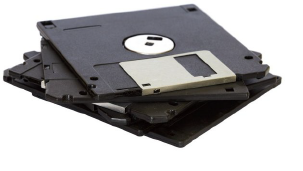

# Using embroidery disks

Paper tape is the traditional medium for storing designs in stitch data format. Embroidery disks, which largely replaced paper tape, are specially formatted floppy disks used to transfer designs from computer to older embroidery machines. You can format embroidery disks and save designs to them from within EmbroideryStudio. The format you use will depend on the machine. Designs are generally stored in stitch data format, although Melco CND, for example, is a ‘condensed’ file format.

You can also open designs from embroidery disks of various formats directly into EmbroideryStudio. Once read, you can output them without change, modify them and output them in the original format, or save them as [EMB](../../glossary/glossary) file. You can optionally convert them into objects. After conversion, a design can be [scaled](../../glossary/glossary) and changed. [See also Opening machine files.](../convert/Opening_machine_files)

## Related topics...

- [Read designs from embroidery disk](Read_designs_from_embroidery_disk)
- [Format embroidery disks](Format_embroidery_disks)
- [Write designs to embroidery disk](Write_designs_to_embroidery_disk)
