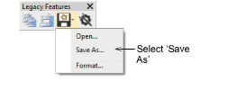
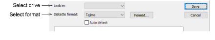
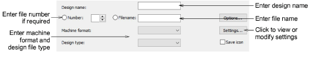

# Write designs to embroidery disk

|  | Use Legacy Features > Embroidery Disk to open designs from or save to proprietary embroidery disk formats. |
| ---------------------------------------------------------- | ---------------------------------------------------------------------------------------------------------- |

Save designs to [embroidery disk](../../glossary/glossary) to stitch out on a specific machine. When you save to a new format, the design is converted to encode the [machine functions](../../glossary/glossary) and commands supported by the particular machine.

## To write designs to embroidery disk...

1. Insert the embroidery disk in your computer’s floppy disk drive.

2. Select Embroidery Disk > Save As.

The Save to Embroidery Disk dialog opens.

3. From the Look In list, select the floppy disk drive.

4. Select the disk format. Either:

- Select the format from the Diskette Format list.
- Select the Auto Detect checkbox and let EmbroideryStudio automatically determine the format.

Any designs already saved on disk are listed in the panel.

Note: If the disk is not formatted, or its format is not correct, click Format.

5. In the Design Name field, enter a name for the design.

6. In the Filename field, enter a name for the design file.

7. If the Number field is enabled, enter a file number.

Not all [machine formats](../../glossary/glossary) require this information. This option is grayed out if the file naming mechanism is not supported by the particular embroidery disk type. Tajima uses a free-form file name, so both a numbering system and a text file name system are supported, as seen in the dialog.

8. From the Machine Format list, select a machine format.

Some machines can read different formats. For example, some Tajima machines can read Barudan as well as Tajima.

Tip: To view or modify machine format settings, click Values.

9. From the Design Type list, select the file type to save to embroidery disk. Only one file type is generally available.

10. If available, select the Save Icon checkbox to include a thumbnail image of the design with the design file.

This icon appears in the machine control panel during stitch-out.

11. Click Save.

Caution: Wait until the light on the floppy disk drive stops flashing before removing the disk.

## Related topics...

- [Standard machine formats](../../Setup/machines/Standard_machine_formats)
