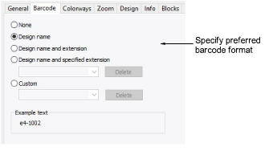

# Barcode options

Some machines read barcodes in order to load designs. Typically, the digitizer will send the design to machine memory or database, then print out a worksheet. The operator will take the worksheet, scan the barcode, and the machine will load the associated file. The Barcode tab allows you to specify a standard format based on design name or a custom format.

Many companies are switching to barcode readers on embroidery machines to ‘pull’ designs from Windows network locations rather than having the computer ‘push’ them to the machine. In addition to design name, some machines require the file extension. Amongst the barcode options, you can choose to include the current file extension or nominate one of your choice – e.g. ‘DST’.

The ‘custom’ option is provided in case you have other barcode requirements – e.g. for pricing purposes.
