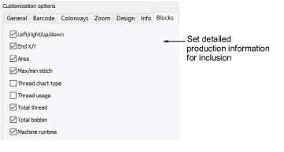
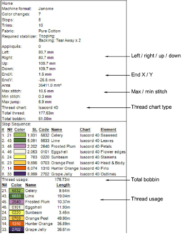

# Blocks options

The Blocks tab lets you further filter production information available on the Design Information docker for inclusion in the printout.

Select design statistics to include on the worksheet:

| Option                   | Function                                                                                                                                                |
| ------------------------ | ------------------------------------------------------------------------------------------------------------------------------------------------------- |
| Left / right / up / down | Depending on where the design start/end point has been set, these figures indicate the distance from that point.                                        |
| End X / Y                | The coordinates of the last stitch.                                                                                                                     |
| Area                     | Total area covered by design – used for estimating hoop sizes, fabric requirements, 3D foam, or whether design will fit target location.                |
| Max / min stitch         | The maximum and minimum stitch lengths, and maximum jump stitch length in the design.                                                                   |
| Thread chart type        | The name of the thread chart used in the design. All required brands for used threads are displayed in a comma-separated list.                          |
| Thread usage             | Meterage of thread required per color.                                                                                                                  |
| Total thread             | Total meterage of top thread required to stitch out the design.                                                                                         |
| Total bobbin             | Total meterage of bottom thread (bobbin) required to stitch out the design.                                                                             |
| Machine runtime          | This checkbox is only available if the feature is available in the software. If there are no machines set up, checking ‘Machine runtime’ has no effect. |

Here is a sample worksheet with all options selected:

## Related topics...

- [Viewing & managing design information](../../Management/manage_designs/Viewing_managing_design_information)
- [Assign thread colors](../../Basics/threads/Assign_thread_colors)
- [Doing runtime estimates](../../Setup/hardware/Doing_runtime_estimates)
- [Design Hooping](../hoops/Design_Hooping)
- [Setting auto start & end](../hoops/Setting_auto_start_end)
