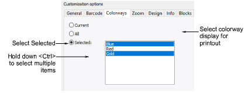
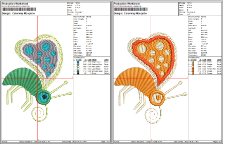
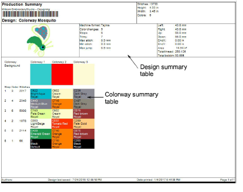

# Colorway options

The Colorways tab allows you to include or exclude selected colorways for the current design.

Separate sheets are generated for each selected colorway.

If the Production Summary report type is selected, the Colorway Summary table is printed together with the Design Summary table. You can also print color blocks in the Colorway Summary table by selecting the Show Colors in Summary option in the Stop Sequence tab.

