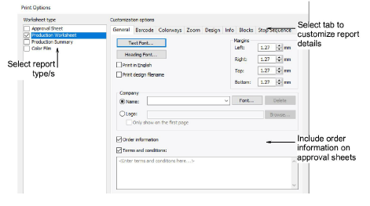

# Customizing design reports

All report types can be customized. For each type you select, tabs allow you to adjust report details. These vary with the report type. The Production Worksheet is the only report type that provides access to all available options.

Typically, reports will include customizations such as:

- Standard header/footer, incorporating company name/logo, customer name, colorway name, user-specified fonts, margin control, etc
- Company name/logo
- Barcode in header – available for all report types
- Multiple vertical ‘full info’ strips allocated on a single page if zoom parameters allow. Alternatively, there is a Start New Page option on Info tab to force the layout to start vertical info strips on a separate page.

Explore the following topics for details.

## Related topics...

- [General options](General_options)
- [Barcode options](Barcode_options)
- [Colorway options](Colorway_options)
- [Zoom options](Zoom_options)
- [Design options](Design_options)
- [Information options](Information_options)
- [Blocks options](Blocks_options)
- [Stop sequence options](Stop_sequence_options)
