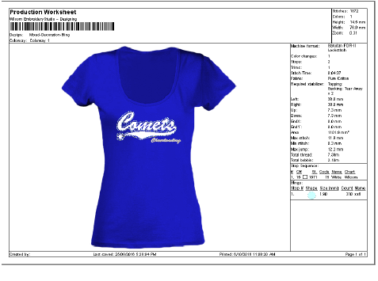

# Design Reports

From the same EMB design file, you can output production worksheets or approval sheets for machine operators or customers respectively.

EmbroideryStudio allows you to customize information in the format you require. The printing capability also allows you to:

- Personalize worksheets with company name and logo
- Print approval sheets with or without design details
- Display the assigned hoop
- Visualize on selected fabric/garment
- Include selected colorways.

Optionally, email production worksheets in PDF format with the embroidery file as an attachment in a specified format – e.g. EMB or DST, etc. Screen images may also be captured in PNG format to distribute designs for viewing in real colors.

## Related topics...

- [Outputting designs as images](Outputting_designs_as_images)
- [Printing design reports](Printing_design_reports)
- [Customizing design reports](Customizing_design_reports)
