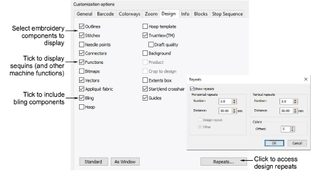

# Design options

Use the Design tab to include background or product with the colorway.

::: tip
Select Crop to Design to crop the empty space around the design.
:::

The Design tab allows you to toggle on/off the same options available on the View toolbar. Print designs in TrueView™ or stitch only, with needle points, connectors, etc, or without. Include background fabric or color as preferred.

Include the hoop with or without the template. Templates include alignment and registration guide markings. These can help production staff align the design in the hoop. You can also include the product backdrop which can guide staff in correct placement.

Print all types of multi-decoration supported by EmbroideryStudio, either separately or in combination. Click the Repeats button to access the dialog and set repeating design options.

## Related topics...

- [Viewing design components](../../Basics/view/Viewing_design_components)
- [Viewing design repeats](../../Basics/view/Viewing_design_repeats)
- [Hoops & templates](../hoops/Hoops_templates)

## Embroidery components

To display embroidery components, select from amongst Outlines, Stitches, Needle Points, Connectors, TrueView in the Design tab. For TrueView to display, you must also have Stitches selected.

## Print only

To display print components only, select between Bitmaps and Vectors.

## Sequin components

To display sequin components, select Functions in the Design tab. A sequin production summary shows color, size and quantities by sequin device as well as a summary on the first page.

## Bling components

To display bling components, select Bling in the Design tab. The bling production summary shows stone colors, sizes, and quantities as well as a summary on the first page.

::: info Note
When bling is output as multiple files, each color is separated into different templates for flood-filling with selected rhinestones.
:::

## Related topics...

- [Output to bling cutter](../../Applied/export/Output_to_bling_cutter)

## Design backgrounds

The Design tab also provides options to display design backgrounds – e.g. fabric, product, and/or hoop.

Amongst background options, you can set:

| Option              | Function                                                                                                                                                     |
| ------------------- | ------------------------------------------------------------------------------------------------------------------------------------------------------------ |
| Hoop                | Include the selected hoop, whether or not currently displayed on screen.                                                                                     |
| Hoop template       | Templates include alignment and registration guide markings. These help align the design in the hoop.                                                        |
| Background          | Include any background currently displayed – color or fabric.                                                                                                |
| Crop to design      | Crop any background to the extends of the design, rather than the full page.                                                                                 |
| Product             | Garment or product backdrop on which to position the design. Use it to display location, size and overall appearance for visualization or approval purposes. |
| Extents box         | Place an outline around the design to delineate its full extents.                                                                                            |
| Start/end crosshair | Print a cross hair across the design indicating design start and end points.                                                                                 |
| Guides              | When contrasting colors are used in the colorway for guide and background colors, guides can be turned off.                                                  |
| Standard            | Reset printing options to default values.                                                                                                                    |
| As Window           | Set printing options as per current settings in the design window.                                                                                           |

## Related topics...

- [Fabric & product backgrounds](../../Digitizing/colorways/Fabric_product_backgrounds)
- [Hoops & templates](../hoops/Hoops_templates)
- [Setting auto start & end](../hoops/Setting_auto_start_end)
