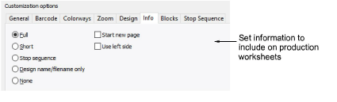

# Information options

Reports include information entered in the Design Information > Summary tab, including comments but excluding keywords. The Info tab lets you filter this information for inclusion on production worksheets.

Customizable options include:

| Option                      | Function                                                                                                                                                                                                            |
| --------------------------- | ------------------------------------------------------------------------------------------------------------------------------------------------------------------------------------------------------------------- |
| Full                        | Includes all design and production information included in the Design Information docker. This information can be further filtered via the Blocks tab.                                                              |
| Short                       | Includes only default header and footer information. Usually used in conjunction with full size design in order to visualize on garment. See also Zoom tab.                                                         |
| Stop sequence               | Includes only stop sequence information on the worksheet. This information can be further filtered via the Stop Sequence tab.                                                                                       |
| Design name / filename only | Includes the design filename as the printout information without any other text.                                                                                                                                    |
| None                        | Eliminates design details altogether and suppresses display of default header and footer information – again, can be used in conjunction with full size design in order to visualize on garment. See also Zoom tab. |
| Start new page              | Prints design details on a separate sheet.                                                                                                                                                                          |
| Use left side               | Displays the information column on the left side of the page (rather than the default right-hand side).                                                                                                             |

## Related topics...

- [Viewing & managing design information](../../Management/manage_designs/Viewing_managing_design_information)
