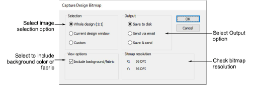
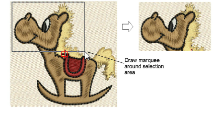
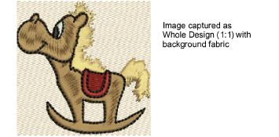

# Outputting designs as images

Designers frequently want to distribute their designs for viewing in real colors, in TrueView™ or otherwise, with or without fabric backgrounds. This might be for stock design sales purposes, for approval of digitized designs, or for presentation on the web or in catalogs. Screen images are captured in PNG format because it supports transparency.

## To output a design as an image...

1. Open the embroidery design.

2. Select File > Capture Design Bitmap.

3. Select a Selection option:

| Option                | Function                                                                         |
| --------------------- | -------------------------------------------------------------------------------- |
| Whole design (1:1)    | Captures the screen image in a ratio of 1:1.                                     |
| Current design window | Captures the screen image at the currently selected zoom factor.                 |
| Custom                | Lets you specify a capture area. You are prompted to define the area to capture. |

4. Select an Output option:

| Option         | Function                                                                                                                                                                                                                                                                                                         |
| -------------- | ---------------------------------------------------------------------------------------------------------------------------------------------------------------------------------------------------------------------------------------------------------------------------------------------------------------- |
| Save to disk   | Save screen capture to disk. The Save Capture Screen dialog allows you to select a location, name and format for the captured design image.                                                                                                                                                                      |
| Send via email | Lets you send the screen capture as an email. A new email message opens with the image attached. This option only works with the default MAPI compliant desktop email. It won’t work with email apps or other clients that don’t support the MAPI standard. Generally, this means MS Outlook email clients only. |
| Save & send    | Lets you both save to hard disk and send as an email attachment.                                                                                                                                                                                                                                                 |

5. Select Include background/fabric to include the background color or fabric with the screen capture.

::: info Note
Bitmap resolution defaults to current screen resolution. Properly calibrated, this figure should be approximately 96 DPI.
:::

## Related topics...

- [Virtual embroidery](../../Applied/mixed/Virtual_embroidery)
