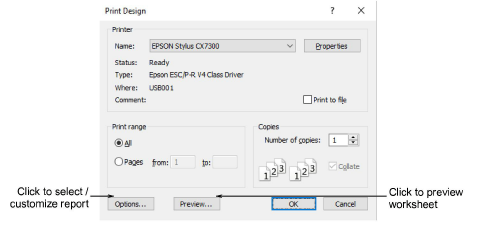
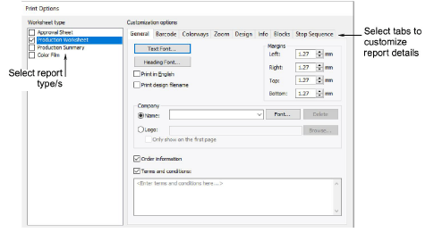
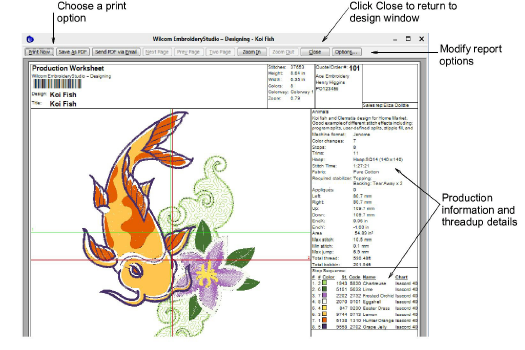
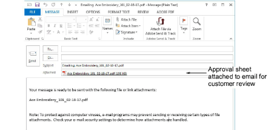

# Print reports

|  | Use Docker > Design Information to view and modify design details prior to design approval or stitchout. |
| ---------------------------------------------------- | -------------------------------------------------------------------------------------------------------- |
|                        | Use Standard > Print to print production worksheets for the current design using the current settings.   |

Create a hard copy of your design report using a printer or plotter. Alternatively create soft copy in PDF format. Optionally, send it directly as an email attachment. Preview the report prior to printing.

## To print a report...

1. Before printing, it’s a good idea to check design information to make sure all details are up-to-date.

2. Click the Print icon or select File > Print.

3. Select the printer or plotter you want to use and required number of copies.

4. To select a report type, click the Options button. The Print Options dialog opens.

5. Select a report type in the Print panel. Multiple reports can be batched as part of the same print run. Tick the checkbox next to each.

6. Select tabs to customize report details as required. Tabs vary with the report type.

7. Click OK to close Print Options.

8. If you are using a plotter, click Properties, and set pen colors to correspond with the thread colors in the design.

::: info Note
Refer to your plotter manual for information on setting up pen colors.
:::

9. Click Preview to inspect the report before sending to print.

10. To print the design, choose an option:

- Print Now: Click to send the design report to your local printer.
- Save as PDF: Click to save the report as a PDF document. You are prompted to save to the hard drive or network location.
- Send PDF via Email: Click to send the report – usually an approval sheet – as a PDF attachment to your local email client. The PDF is automatically identified by customer name, order number, and current date.

## Related topics...

- [Viewing & managing design information](../../Management/manage_designs/Viewing_managing_design_information)
- [Customizing design reports](Customizing_design_reports)
