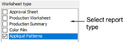
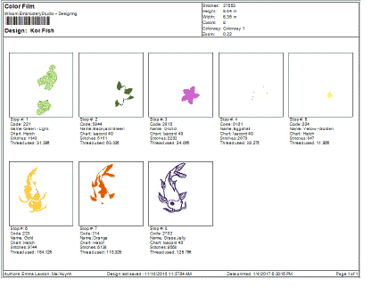

# Report types

In addition to production worksheets, EmbroideryStudio provides a number of predefined report types including approval sheets, production summaries, color films, and appliqué patterns.

Report types include:

| Report type          | Function                                                                                                                                         |
| -------------------- | ------------------------------------------------------------------------------------------------------------------------------------------------ |
| Approval sheet       | This is intended for the customer, not production staff. Customers can see what they are ordering and approve accordingly.                       |
| Production worksheet | This is intended for production staff. All production-related information, such as bobbin length, design size, garment fabric, etc, is provided. |
| Production summary   | This provides two summary tables of the design and associated colorways – a Colorway Summary together with a Design Summary.                     |
| Appliqué patterns    | This shows appliqué patterns – cutter information – isolated from the design. This tells the operator which appliqué pieces are to be included.  |

## Color films

This report type lets you print color blocks in the design as they appear in the Color-Object List. This allows production staff to see each stitch color in order of stitchout. Separate color films are printed for selected [colorways](../../glossary/glossary) on the last page of the worksheet.

## Related topics...

- [Customizing design reports](Customizing_design_reports)
- [Print appliqué patterns](../../Applied/export/Print_appliqué_patterns)
