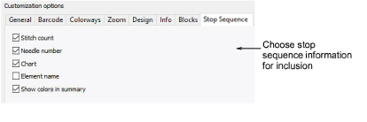
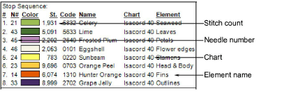
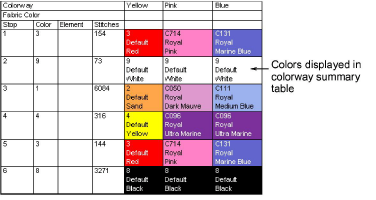

# Stop sequence options

The Stop Sequence tab lets you further filter production information available on the Design Information docker for inclusion in the printout.

Select the statistics for each color block:

| Option                 | Function                                                                                                              |
| ---------------------- | --------------------------------------------------------------------------------------------------------------------- |
| Stitch count           | Include number of stitches per color.                                                                                 |
| Needle number          | Include needle number corresponding to each color change. This is only really relevant to needle-addressing machines. |
| Chart                  | Brand name of thread chart used.                                                                                      |
| Element name           | User-defined name to identify each color block.                                                                       |
| Show colors in summary | Include color samples in a colorway summary table.                                                                    |

Here is a sample production worksheet with all options selected:

If the Production Summary report type is selected, the Colorway Summary table is printed together with the Design Summary table. You can also print color blocks in the Colorway Summary table by selecting the Show Colors in Summary option in the Stop Sequence tab.

## Related topics...

- [Viewing & managing design information](../../Management/manage_designs/Viewing_managing_design_information)
- [Name design elements](../../Digitizing/colorways/Name_design_elements)
- [Colorway options](Colorway_options)
