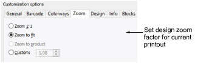

# Zoom options

The Zoom tab lets you set a zoom factor for the design preview and physical printout.

Customizable options include:

| Option          | Function                                                      |
| --------------- | ------------------------------------------------------------- |
| Zoom 1.1        | Shows design at actual size.                                  |
| Zoom to fit     | Scales design to fill available space on the printout.        |
| Zoom to product | Scales whole product to fill available space on the printout. |
| Custom          | Sets a specific zoom factor.                                  |

## Related topics...

- [Visualize products](../../Digitizing/colorways/Visualize_products)
