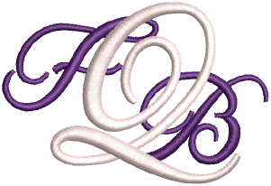

# Stitch Quality

EmbroideryStudio provides many settings to ensure high quality stitchout on any fabric. For instance, to sew out correctly, an object must have correct [stitch spacing](../../glossary/glossary#stitch-spacing), sufficient [pull compensation](../../glossary/glossary#pull-compensation) together with a suitable underlay for the combination of cover stitch type, object type, object shape and fabric. Auto Fabric provides a set of customized [fabric settings](../../glossary/glossary#fabric-settings) so the software will take into account the type of fabric you are stitching on. However, you can override these on an object-by-object basis as necessary. [See also Working with fabrics.](../../Digitizing/properties/Working_with_fabrics)

## Underlays & pull compensation

This section describes how to set and adjust automatic underlays. It also deals compensating for fabric stretch with automatic pull compensation. [See Underlay & Pull Compensation for details.](../underlays/Underlay_Pull_Compensation)

## Optimizing stitch quality

This section describes how to adjust stitch density as well as eliminate small stitches. It also explains controlling corner stitching and reducing stitch bunching. Optimizing long satin stitches is also covered. [See Optimizing Stitch Quality for details.](../quality/Optimizing_Stitch_Quality)

## Embroidery connectors

This section describes how to add [connectors](../../glossary/glossary#connectors), tie-offs and trims to your designs. It also describes adjusting settings for automatic connectors, including the [stitch length](../../glossary/glossary#stitch-length) for travel runs. It also deals with setting automatic start and end points. [See Embroidery Connectors for details.](../connectors/Embroidery_Connectors)
