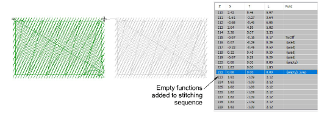

# Add empty stitches & jumps

|  | Click Function > Insert Empty Stitch to insert an empty stitch. |
| ---------------------------------------------------- | --------------------------------------------------------------- |
|    | Click Function > Insert Empty Jump to insert an empty jump.     |

Empty stitch is a tight (zero length) lockstitch used together with, or as an alternative to, tie-in and tie-off stitches. Use empty stitches instead of tie-ins or tie-offs for objects filled with light density stitching where standard tie-ins and tie-offs may be visible. Also, use empty stitches or empty jumps when required by the selected [machine format](../../glossary/glossary#machine-format).

## To add empty stitches and jumps...

1. Travel to the needle position where you want to trim the thread.

2. Click the Insert Empty Stitch icon to insert an empty stitch.

3. Click the Insert Empty Jump icon to insert an empty jump.

::: tip
You can also insert [machine functions](../../glossary/glossary) manually using the Insert Machine Function dialog.
:::

## Related topics...

- [Travel through designs](../../Basics/view/Travel_through_designs)
- [Insert machine functions manually](../../Modifying/functions/Insert_machine_functions_manually)
