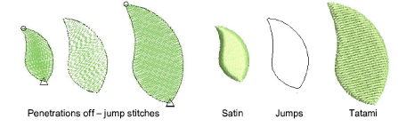

# Add jumps with penetrations off

|  | Deselect Function > Penetrations to create jumps with needles or borers out. |
| -------------------------------------------- | ---------------------------------------------------------------------------- |

You can create jump [connectors](../../glossary/glossary) manually in a design by digitizing with penetrations off. The Penetrations tool prevents the needle from penetrating the fabric, forcing the machine to move across the design in a series of jumps. You can use Penetrations with any input method.

## To add a jump with penetrations off...

1Select an input method – e.g. Run.

2Deselect Penetrations.

3Digitize the connector in the usual way for the selected input method.

The jumps are saved together as an embroidery object.

